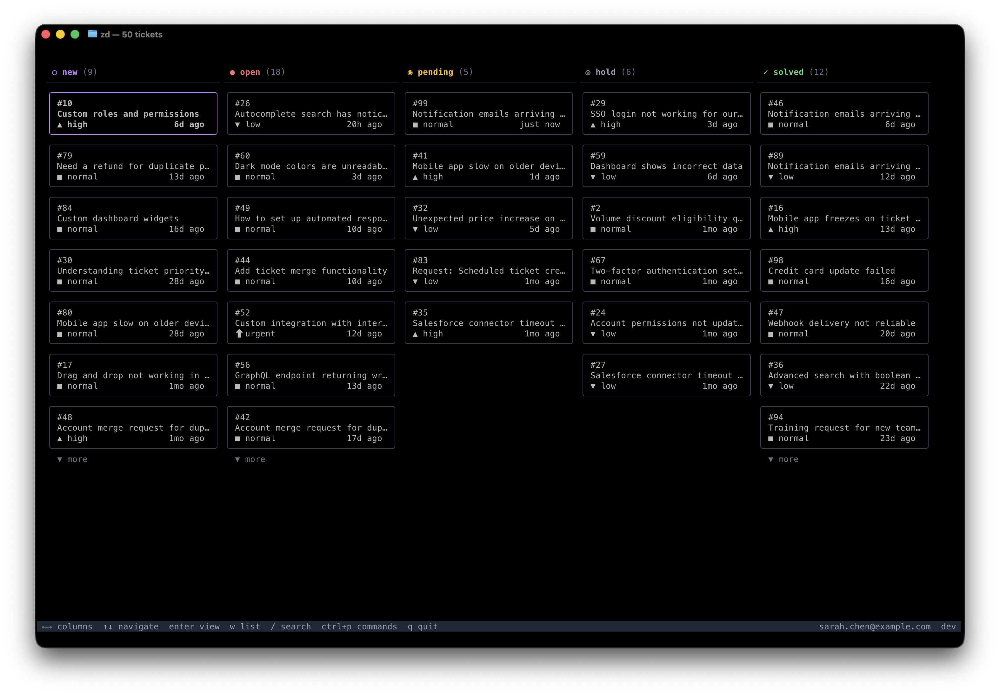

# Zendesk CLI (`zentui`)

[](https://github.com/itsolver/zentui/releases/latest)
[](https://github.com/itsolver/zentui/actions/workflows/build.yml)
[](https://goreportcard.com/report/github.com/itsolver/zentui)
[](https://pkg.go.dev/github.com/itsolver/zentui)
[](LICENSE)

An unofficial, agent-friendly command-line interface for Zendesk's ticketing REST API. Built for both humans and AI agents.

This fork is based on `johanviberg/zd` and keeps the original MIT license attribution while repurposing the operator app for IT Solver's focused Zendesk workflow.




## What it does

`zentui` lets you manage Zendesk tickets from the terminal. List, search, create, update, and delete tickets with structured output that works well in scripts and AI agent workflows. It includes built-in discovery commands (`zentui commands` and `zentui schema`) that let AI agents introspect the CLI at runtime, so they can figure out what's available without hardcoded knowledge.

## Installation

### go install

```bash
go install github.com/itsolver/zentui@latest
```

### Linux (deb)

Download the `.deb` package from the [latest release](https://github.com/itsolver/zentui/releases/latest):

```bash
sudo dpkg -i zentui_*_linux_x86_64.deb
```

### Linux (rpm)

```bash
sudo rpm -i zentui_*_linux_x86_64.rpm
```

### Alpine Linux (apk)

```bash
sudo apk add --allow-untrusted zentui_*_linux_x86_64.apk
```

### Binary download

Pre-built binaries are available for Linux, macOS, Windows, and FreeBSD on amd64, arm64, 386, and armv7. Download from the [latest release](https://github.com/itsolver/zentui/releases/latest) and place the `zentui` binary on your `PATH`.

### Build from source

```bash
git clone https://github.com/itsolver/zentui.git
cd zentui
go build -o zentui
```

## Shell completions

If you installed from a package, completions are set up automatically. For other installation methods:

```bash
# Bash
zentui completion bash > /etc/bash_completion.d/zentui          # Linux
zentui completion bash > $(brew --prefix)/etc/bash_completion.d/zentui  # macOS

# Zsh
zentui completion zsh > "${fpath[1]}/_zentui"

# Fish
zentui completion fish > ~/.config/fish/completions/zentui.fish

# PowerShell
zentui completion powershell > zentui.ps1  # then source from your profile
```

## Authentication

Choose **one** of the methods below. Do not mix methods — `zentui` uses the first credentials it finds (environment variables take priority over stored credentials).

### OAuth (recommended)

OAuth is the recommended authentication method. It uses a browser-based consent flow with PKCE, avoids putting secrets on the command line, and the resulting token is scoped to only the permissions you grant. Tokens auto-refresh transparently when a refresh token is available.

#### 1. Register an OAuth client in Zendesk (admin, one-time)

1. In Admin Center, go to **Apps and integrations → APIs → OAuth clients**, then click **Add OAuth client**.
2. Fill in the fields:
   - **Name** — e.g. `zentui CLI` (shown to users on the consent screen)
   - **Description** — optional
   - **Client kind** — select **Public** (recommended — no client secret needed, secured via PKCE). Select **Confidential** if your security policy requires a client secret.
   - **Redirect URLs** — enter `http://127.0.0.1/callback` (the CLI starts a local server on a random port; Zendesk matches on host and path, ignoring the port for localhost)
3. Click **Save** and note the **Identifier** field — this is the Client ID.

#### 2. Configure the CLI (admin or first-time setup)

```bash
zentui config set subdomain mycompany
zentui config set oauth_client_id YOUR_CLIENT_ID
```

This only needs to be done once per machine (or distribute the `config.yaml` file to your team).

#### 3. Log in

```bash
zentui auth login
```

This opens a browser window for the OAuth consent flow. The CLI requests `read write` scopes. The access token and refresh token are stored locally. Subsequent API calls auto-refresh the token when it expires.

If you're using a **confidential** OAuth client, pass the secret on login:

```bash
zentui auth login --client-secret YOUR_CLIENT_SECRET
```

### API token

If you can't use OAuth (e.g. in headless environments or CI), you can authenticate with an API token instead:

```bash
zentui auth login --method token \
  --subdomain mycompany \
  --email you@example.com \
  --api-token YOUR_API_TOKEN
```

### Environment variables

As an alternative to `auth login`, you can set environment variables. This is useful for CI/CD or scripts. Environment variables always take priority over stored credentials.

```bash
# OAuth token
export ZENDESK_SUBDOMAIN=mycompany
export ZENDESK_OAUTH_TOKEN=your_oauth_token

# Or API token
export ZENDESK_SUBDOMAIN=mycompany
export ZENDESK_EMAIL=you@example.com
export ZENDESK_API_TOKEN=your_token
```

### Check auth status

```bash
zentui auth status
```

## Quick start

```bash
# List recent tickets
zentui tickets list

# Show a specific ticket
zentui tickets show 12345

# Create a ticket
zentui tickets create --subject "Printer broken" --comment "The office printer is not responding"

# Update a ticket
zentui tickets update 12345 --status pending --comment "Waiting on vendor" --public=false

# Search tickets
zentui tickets search "status:open priority:high"

# Delete a ticket (requires confirmation)
zentui tickets delete 12345 --yes
```

### Natural language search

`zentui tickets search` accepts natural language queries, which are locally translated to Zendesk search syntax (no API key needed). Queries already in Zendesk syntax pass through unchanged.

```bash
zentui tickets search "urgent tickets assigned to jane"
zentui tickets search "open tickets created this week"
```

### Demo mode

The `--demo` flag lets you explore `zentui` without authentication. It generates 100+ synthetic tickets locally.

```bash
zentui tui --demo
zentui tickets list --demo
zentui tickets show 42 --demo
```

Works with `tickets list`, `tickets show`, `tickets search`, `tickets comments`, and `tui`.

Use `--demo-role` to simulate different Zendesk roles:

```bash
# Experience the TUI as a light agent (internal notes only, no status changes)
zentui tui --demo --demo-role light_agent

# Test admin behavior
zentui tickets delete 1 --demo --demo-role admin --yes
```

Valid roles: `agent` (default), `light_agent`, `admin`.

## Interactive TUI

`zentui` includes an optional interactive terminal UI for browsing and managing tickets. Launch it with:

```bash
zentui tui
```

The TUI provides:

- **Split-panel layout** — default side-by-side view with ticket list on the left and detail on the right; auto-collapses to single panel on narrow terminals (<80 cols)
- **Ticket list** — browse tickets with `j`/`k` or arrow keys, color-coded status and priority
- **Panel control** — press `tab` to switch focus between panels, `v` to toggle the detail panel
- **Infinite scroll** — auto-loads the next page when reaching the bottom of the list; or press `n`
- **Detail view** — press `enter` to view a ticket's details, description, and audit timeline (scroll with arrows); press `f` to toggle between all events and comments-only
- **Search** — press `/` to search using Zendesk search syntax or natural language (e.g. `status:open priority:high`), `esc` to clear
- **Comment** — press `c` to add a comment, toggle between public reply and internal note with `tab`, add CC recipients with `ctrl+a`, submit with `ctrl+s`
- **Status/Priority** — press `s` or `p` to change status or priority via a picker
- **Auto-refresh** — press `r` to toggle auto-refresh (polls every 5 min with countdown), `R` for an immediate refresh; new tickets are highlighted with a star and a terminal bell sounds
- **Kanban board** — press `w` to toggle a kanban view that groups tickets by status into columns; navigate with arrow keys or `h`/`j`/`k`/`l`
- **Status chart** — press `b` to toggle a vertical bar chart showing ticket status distribution, color-coded to match status labels
- **Dynamic window title** — terminal tab title updates to reflect current context (ticket count, search query, or ticket detail)
- **My tickets** — press `m` to toggle a filter showing only tickets assigned to you; press `m` again or `esc` to clear
- **Go to ticket** — press `g` to jump directly to a ticket by ID
- **Image attachments** — press `i` in detail view to browse image attachments across comments and open them in your default app (e.g. Preview on macOS)
- **Open in browser** — press `o` to open the selected ticket in your default browser
- **Status bar** — shows the authenticated user in the bottom bar
- **Navigation** — `esc` to go back, `q` to quit

The TUI uses the same authentication and service layer as the CLI commands — no additional setup required.

## Role-based permissions

`zentui` detects the authenticated user's Zendesk role and automatically adapts the available features. This applies across CLI commands, the TUI, and the MCP server.

| Capability | Admin | Agent | Light Agent |
|---|---|---|---|
| List / show / search tickets | Yes | Yes | Yes |
| Post public comments | Yes | Yes | No (internal only) |
| Change ticket status | Yes | Yes | No |
| Assign tickets | Yes | Yes | No |
| Add CCs to comments | Yes | Yes | No |
| Delete tickets | Yes | Yes | No |
| Change priority | Yes | Yes | Yes |

Light agents are identified by the `role_type` field (value `1`) or the `restricted_agent` flag from the Zendesk API. When a light agent is detected:

- **CLI** — restricted flags (`--public`, `--status`, `--assignee-id`, `--cc`) return a clear error. Comments default to internal notes.
- **TUI** — the public/internal toggle and CC picker are hidden. The status key binding (`s`) is disabled. The command palette hides unavailable actions.
- **MCP server** — tool calls with restricted parameters return descriptive error messages instead of passing through to the Zendesk API.

If the user's role cannot be determined (e.g. network error), `zentui` assumes full permissions. The Zendesk API enforces restrictions server-side regardless.

## Output formats

Use `--output` (or `-o`) to control how results are formatted:

```bash
# Human-readable table (default)
zentui tickets list

# JSON
zentui tickets list -o json

# Newline-delimited JSON (one object per line, good for piping)
zentui tickets list -o ndjson
```

### Field projection

Use `--fields` to select specific fields:

```bash
zentui tickets list --fields id,status,subject -o json
```

### Sideloading related records

Use `--include` to sideload related data (e.g. users) alongside tickets. This resolves IDs like `requester_id` and `assignee_id` into human-readable names and emails:

```bash
# Show a ticket with requester and assignee names
zentui tickets show 12345 --include users

# List tickets with user names in the table
zentui tickets list --include users

# Combine with field projection
zentui tickets show 12345 --include users --fields id,subject,requester_name,assignee_name
```

When users are sideloaded, the output is enriched with `requester_name`, `requester_email`, `assignee_name`, and `assignee_email` fields.

Errors always go to stderr. When using `--output json`, errors are also structured JSON on stderr.

## Using with AI agents

`zentui` is designed to be used by AI agents like Claude Code, Claude Desktop, Cursor, and Windsurf.

### MCP server (recommended)

`zentui` includes a built-in [Model Context Protocol](https://modelcontextprotocol.io) server that exposes Zendesk operations as tools. No wrapper scripts or extra dependencies — it ships in the same binary.

#### Claude Code

```bash
claude mcp add zendesk -- zentui mcp serve
```

#### Claude Desktop

Add to `~/Library/Application Support/Claude/claude_desktop_config.json`:

```json
{
  "mcpServers": {
    "zendesk": {
      "command": "zentui",
      "args": ["mcp", "serve"]
    }
  }
}
```

#### Cursor / Windsurf

Point at `zentui mcp serve` in your editor's MCP settings. The server communicates over stdio.

#### Available tools

| Tool | Description |
|---|---|
| `zendesk_list_tickets` | List tickets sorted by update time, with optional status/assignee/group filters |
| `zendesk_show_ticket` | Show full ticket details with requester and assignee info |
| `zendesk_search_tickets` | Search using Zendesk query syntax |
| `zendesk_create_ticket` | Create a ticket with subject, body, priority, and tags |
| `zendesk_update_ticket` | Update a ticket: add comments (public or internal), change status/priority, manage tags, add CCs |
| `zendesk_delete_ticket` | Permanently delete a ticket |

The MCP server uses the same authentication as the CLI — run `zentui auth login` first. Demo mode works too: `zentui mcp serve --demo`.

### Agent skill

`zentui` also ships with an agent skill under `skills/zentui/` for agents that prefer calling CLI commands directly.

### Self-describing commands

Two built-in commands make `zentui` discoverable at runtime, even without the skill or MCP server:

#### Command discovery

`zentui commands` lists every available command with its flags, types, defaults, and argument names:

```bash
zentui commands -o json
```

An agent can call this once to learn the full CLI surface.

#### JSON Schema for tool calling

`zentui schema` generates a JSON Schema for any command's input, which maps directly to tool-calling conventions:

```bash
zentui schema --command "tickets create"
```

This returns a schema with property types, required fields, and defaults that an agent can use to construct valid calls.

## Command reference

| Command | Description |
|---|---|
| `zentui auth login` | Authenticate with Zendesk (OAuth or API token) |
| `zentui auth logout` | Remove stored credentials |
| `zentui auth status` | Show current authentication status |
| `zentui tickets list` | List tickets (supports `--include`) |
| `zentui tickets show <id>` | Show a ticket (supports `--include`) |
| `zentui tickets create` | Create a ticket |
| `zentui tickets update <id>` | Update a ticket (comment, status, priority, tags, CCs) |
| `zentui tickets delete <id>` | Delete a ticket |
| `zentui tickets search <query>` | Search tickets (supports `--include` and natural language) |
| `zentui tickets comments <id>` | List comments on a ticket (supports `--include`) |
| `zentui articles list` | List Help Center articles |
| `zentui articles show <id>` | Show a Help Center article |
| `zentui articles search <query>` | Search Help Center articles |
| `zentui mcp serve` | Start MCP server on stdio for AI agent integration |
| `zentui completion` | Generate shell autocompletion (bash, fish, powershell, zsh) |
| `zentui tui` | Interactive terminal UI for managing tickets |
| `zentui config show` | Show current configuration |
| `zentui config set <key> <value>` | Set a configuration value |
| `zentui commands` | List all commands with flags (for agent discovery) |
| `zentui schema --command "..."` | JSON Schema for a command's input |
| `zentui version` | Print version information |

### Global flags

| Flag | Description |
|---|---|
| `-o, --output` | Output format: `text`, `json`, `ndjson` (default: `text`) |
| `--fields` | Field projection (comma-separated) |
| `--no-headers` | Omit table headers in text mode |
| `--non-interactive` | Never prompt for input |
| `--yes` | Auto-confirm prompts |
| `--subdomain` | Override Zendesk subdomain |
| `--profile` | Config profile (default: `default`) |
| `--demo` | Use synthetic demo data (no auth required) |
| `--demo-role` | Demo mode role: `agent`, `light_agent`, `admin` |
| `--trace-id` | Trace ID attached to API requests |

## Configuration

Config files live in `$XDG_CONFIG_HOME/zentui/` (typically `~/.config/zentui/`):

- `config.yaml` -- settings per profile
- `credentials.json` -- stored auth tokens (file permissions: 0600)

### Profiles

You can maintain multiple Zendesk accounts using profiles:

```bash
# Login to a second account
zentui auth login --profile staging --subdomain mycompany-staging --method token \
  --email you@example.com --api-token STAGING_TOKEN

# Use it
zentui tickets list --profile staging
```

### Setting config values

```bash
zentui config set subdomain mycompany
zentui config show
```

## Exit codes

| Code | Meaning |
|---|---|
| 0 | Success |
| 1 | General error |
| 2 | Argument error |
| 3 | Authentication error |
| 4 | Retryable error (rate limited) |
| 5 | Not found |

## License

MIT
